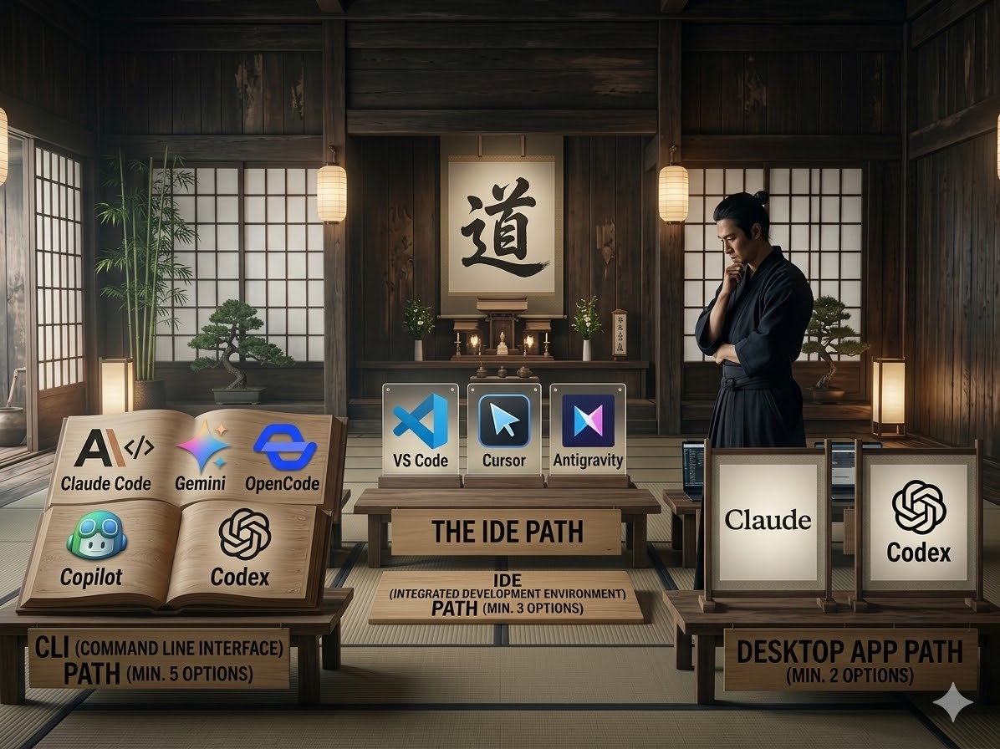

# AI Kata Dojo

A place to practice your AI skills.

## How It Works

| Stage | Name | Time | What You Do |
|-------|------|------|-------------|
| 1 | [Suit Up](./suit-up/) | 3 min | Pick your AI tool and get it open |
| 2 | [Basic Forms](./basic-forms/) | 7 min | Practice the fundamentals of your tool |
| 3 | Circle Up | 5 min | Share what surprised you |
| 4 | [Choose Your Path](./paths/) | 10 min | Pick a topic, go deep |
| 5 | Bow Out | 5 min | Share takeaways |

## Paths

| Path | What You Will Achieve |
|------|-----------------------|
| [Prompt Craft](./paths/prompt-craft/) | Write a prompt that works on the first try |
| [Context Management](./paths/context-management/) | Solve a task with minimal, targeted context |
| [Error Recovery](./paths/error-recovery/) | Fix an AI mistake surgically |
| [Custom Instructions](./paths/custom-instructions/) | Create a config file that makes every session smarter |
| [Multiple Sessions](./paths/multiple-sessions/) | Switch between two tasks without losing context |
| [Code Review](./paths/code-review/) | Run an AI-assisted review on a real PR |
| [Daily Summaries](./paths/daily-summaries/) | Generate today's standup summary in under 2 minutes |
| [Notes and Memory](./paths/notes-and-memory/) | Set up persistent memory across sessions |
| [Autonomy](./paths/autonomy/) | Let AI plan and execute a scoped multi-step task |
| [Integrations](./paths/integrations/) | Connect your tool to GitHub, Slack, or another service via CLI or MCP |
| [Debugging](./paths/debugging/) | Diagnose a bug using hypothesis-driven debugging |
| [Testing](./paths/testing/) | Write tests using TDD with AI that catch real bugs |
| [Large Project Orchestration](./paths/large-project-orchestration/) | Break a big task into an AI-executable plan |
| [Slides Generation](./paths/slides-generation/) | Generate a real 5-slide presentation |
| [Image Generation](./paths/image-generation/) | Create a diagram or mockup you can actually use |

## Who This Is For

Anyone -- from first-time AI tool users to power users looking to sharpen specific skills.
